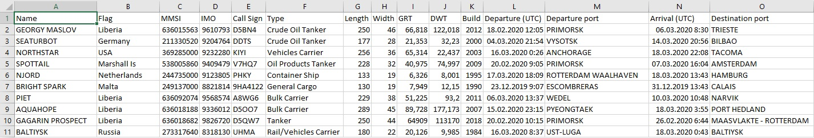
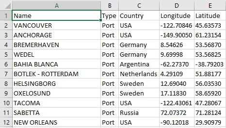

# Описание
Класс, написанный на языке Python, позволяющий получить
следующую информацию о судах:
```
- Название (Name)
- Флаг (Flag)
- MMSI
- IMO
- Позывной (Call Sign)
- Тип (Type)
- Длина, м (Length)
- Ширина, м (Width)
- Грузоподъемность, т (GRT)
- Дедвейт (DWT)
- Год постройки (Build)
- Время отправления из порта отправления (UTC) (Departure)
- Порт отправления (Departure port)
- Время прибытия в порт назначения (UTC) (Arrival)
- Порт назначения (Destination port)
```

А также информацию о портах:
```
- Название (Name)
- Тип (Type)
- Страна (Country)
- Долгота (Longitude)
- Широта (Latitude)
```


# Инструкция по использованию
```python
mmsi_arr = [636015563, 211330520, 369285000, 538005860, 244735000, 249137000, 636092074, 636018188, 636018682]

vessel_csv = r'your_vessel.csv_path'
ports_csv = r'your_ports.csv_path'

vf = VesselFinder(mmsi_arr, vessel_csv, ports_csv)

vf.write_vessels()
vf.write_ports()
vf.write_vessels_img()
```
В массиве **mmsi_arr** задаются MMSI-номера судов, по которым будет
осуществлятся поиск информации, массив портов сгенерируется в программе
автоматически, т.к. он создается из тех портов, которые использовали
суда в качестве пункта отправления или назначения.

В переменных **vessel_csv** и **ports_csv** находятся определяемые
пользователем пути к файлам с форматом .csv

Далее создается экземпляр класса **VesselFinder**, аргументами
конструктора которого являются:
- Массив MMSI-номеров судов (mmsi_arr),
- Путь к файлу csv, куда запишется информация о судах (vessel_csv)
- Путь к файлу csv, куда запишется информация о портах (ports_csv)

#### С помощью метода **write_vessels()** записывается информация о судах
#### С помощью метода **write_ports()** записывается информация о портах
#### С помощью метода **write_vessels_img()** записываются изображения судов в формате jpg

# Пример результирующих файлов
Файл с информацией о судах:


Файл с информацией о портах:


Папка с изображениями судов:

